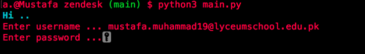
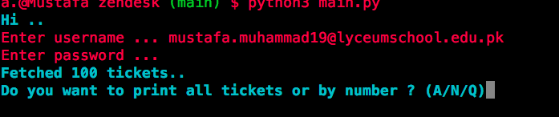
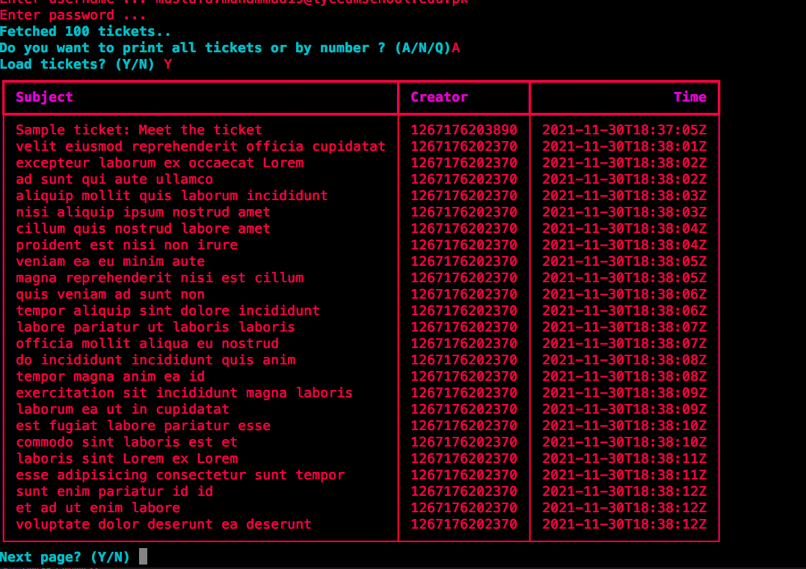
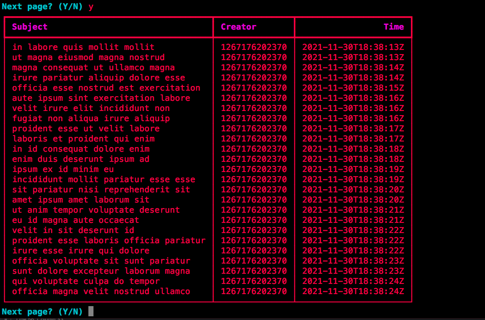

# zendesk-coding-challenge
#### Mustafa Muhammad's submission for the zendesk coding challenge
---

## Project Description

```
Simple CLI tool to fetch customer tickets, paginate or display by index.
```

---

## Instructions

```
1. Clone the project
2. Create a new virtual environment (conda env create -n <name>)
3. run: pip install -r requirements.txt in your shell
4. run main.py as main file
```

---

---

## Images






---

## Contributor(s)
- Mustafa Muhammad 